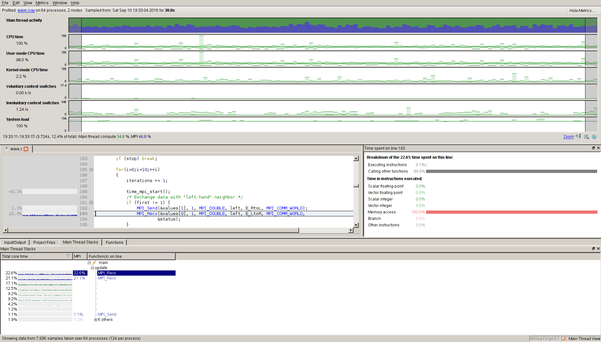

To use Allinea **DDT**/**MAP** we need to compile it with the module *allinea-forge/6.1* loaded::

	$ module load allinea-forge/6.1

If a change of the environment is necessary, make sure you perfom it **before** loading the **allinea-forge/6.1** module. For example::

	$ module sw PrgEnv-cray PrgEnv-intel
	$ module load allinea-forge/6.1

Running Allinea MAP
*******************

On Beskow the program must either be dynamically linked (using **-dynamic**) or explicitly linked with the Allinea profiling libraries.

Here is an example from the official documentation ::

  $ cd $SNIC_TMP
  $ mkdir apr-test
  $ cd map-test
  $ cp /pdc/vol/allinea-forge/6.1/examples/wave.c .
  $ cc wave.c -o wave.x -dynamic

The binary ``wave.x`` is now instrumented for Allinea MAP (and DDT).

In order to run you must prepend the **aprun** command in your bash scipt or interactive run with **map --profile**. Here is a simple script that runs the example compiled above:

.. literalinclude:: files/run-map
    :language: bash

One can also ignore the *aprun* command **but not its options** (see above example). Allinea MAP is aware of that applications are run with aprun on Beskow
The run will generate two additional files next to the normal output of the profiled application, namely::

  <app>_<cores>p_<date-stamp>_<time-stamp>.map

You can open the **map** file in Allinea Forge GUI. The reuslt will look similar to this one:

