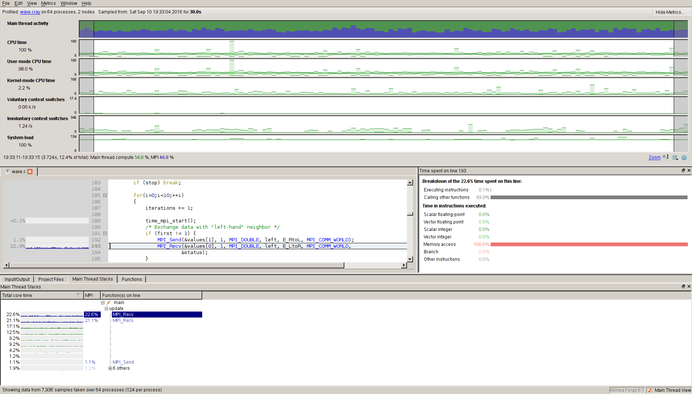

Load the appropiate compilers and the module allinea-reports/6.1 ::

  $ module load gcc/5.1
  $ module load openmpi/1.10-gcc-5.1
  $ module load allinea-forge/6.1

Running example
_______________

Here is an example from the official documentation ::

  $ mkdir forge-test
  $ cd forge-test
  $ cp /afs/pdc.kth.se/pdc/vol/allinea-forge/6.1/amd64_co7/examples/wave.c .
  $ mpicc  wave.c -o wave.gnu -lm

The binary ``wave.gnu`` is now instrumented for Allinea MAP (and DDT).

In order to run you must prepend the *mpirun* command in your bash script or interactive run with **map --profile**. Here is a simple script that runs the example compiled above:

.. literalinclude:: files/run-forge
    :language: bash

One can also ignore the ``mpirun`` command but not its options (see above example). Allinea MAP is aware of that applications are run with mpirun on Tegner. The run will generate two additional files next to the normal output of the mapped application, namely:

  <app>_<cores>p_<date-stamp>_<time-stamp>**.map**

You can open the **map** file in Allinea Forge GUI. The reuslt will look similar to this one:

