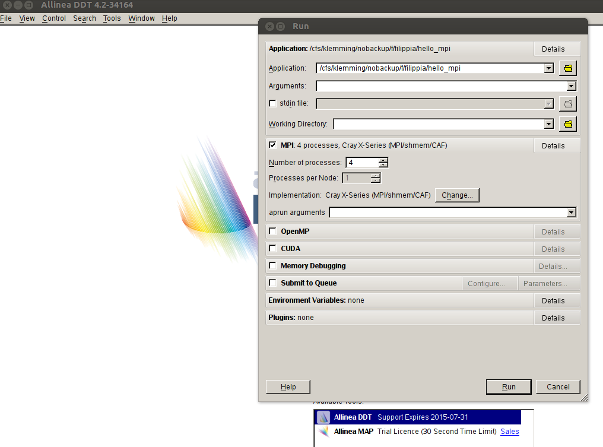
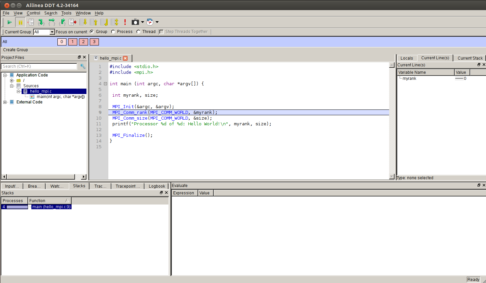
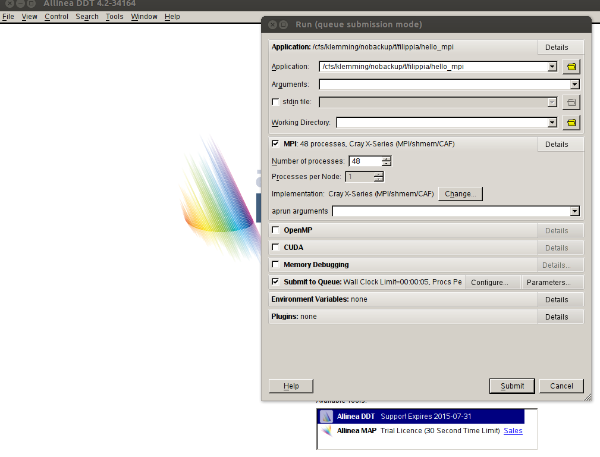
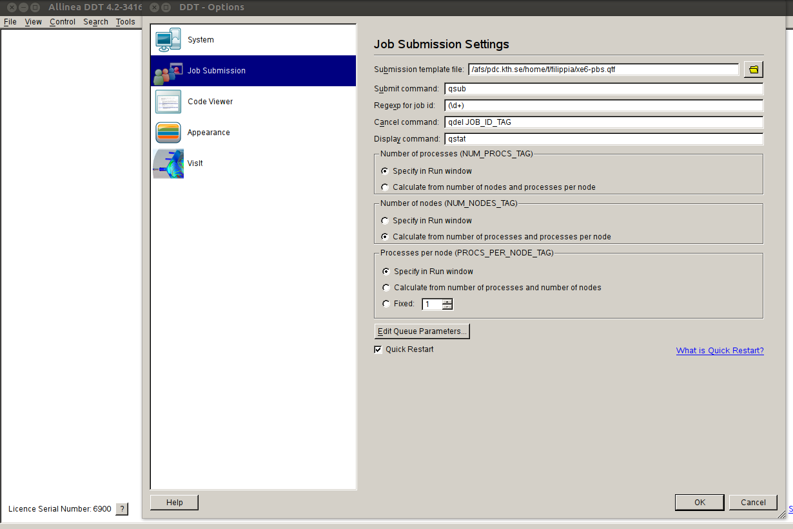
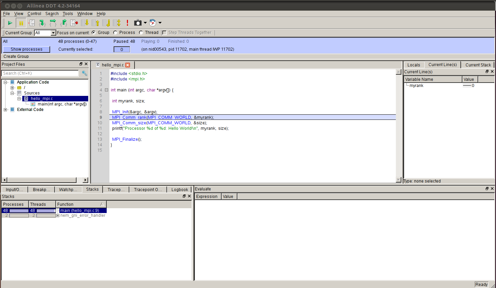

Make sure that your codes are stored in file system /cfs/klemming and DDT is
also launched from the file system /cfs/kemming. If you want to quickly debug
your code with less than 32 processes, you can run the code on interactive
nodes that you book with ``salloc``.

Interactive use on interactive nodes
------------------------------------

As an example, the following command is used to launch DDT in order to debug
the program ``hello_mpi`` using 4 processes on one interactive node::

  ddt -noqueue -n 4 ./hello_mpi

DDT starts with the 'Run Options' window. The settings are grouped into
sections "MPI", "OpenMP", "CUDA", etc. Click 'Details' button to expand a
section. Here you can find the details in MPI section: 4 processes.
Cray/X-Series system. 'Submit to Queue' option is disabled as we started DDT
with -noqueue option.

If everything goes fine, the DDT Main Window like the one in the following
figure should display on the screen when you click button "Run". You can now
use various DDT debugging tools to debug your problems, see the `DDT User Guide
<http://www.allinea.com/products/ddt-support>`_.

Interactive use with nodes booked on the queue system
-----------------------------------------------------

In order to use the queue system on Beskow, you have to modify the setting variable "shared directory = ~" to::

  shared directory = /cfs/klemming/nobackup/y/yourName 

in the configure file ``~/.ddt/config.ddt``.

The following command is used to launch DDT to debug a program called hello_mpi
with no arguments using 64 processes (2 nodes) in batch system::

  ddt -n 64 ./hello_mpi

If you have previously used DDT in interactive node, perhaps the information
"no queue" is still valid. Check the box 'Submit to Queue' to change this
option.

Click on Configure to set up submission options.

In the pop-up window choose "Job Submission" in the left table.  If a
submission template file (e.g. cray-slurm.qtf) is correctly uploaded, the other
boxes such as "Submit command", "Regexp for job id" etc. will be automatically
filled.

You can also change the default submission Parameters described in the template
file. To do this, just click on "Edit Queue Parameters ..." button and a Window
with title "Queue Submission Parameters" will display and you can edit the
boxes to change "Wall Clock Limit" and the number of processes per node
(default 32 for Beskow).

By clicking "Submit", the job has been submitted and stayed in the queue
system.

.. image:: files/wait_queue.png
    :width: 500pt

If everything is OK, the DDT Main Window, like the following one, should be
displayed on the screen when the job is finished.

One sample template file cray-slurm.qtf used to submit job on Beskow is written as

.. literalinclude:: files/cray-slurm.qtf
    :language: bash

More template files for submission can be found at /pdc/vol/allinea-tools/4.2.2/templates/.

Non interactive use (batch mode report)
---------------------------------------

It is also possible to run DDT in a non-interactive mode and to create an HTML
report. To do this, use the following command to create the HTML report::

  ddt -offline report.html -n 32 ./hello_mpi

Note that DDT will re-use the latest automatically saved session for the
example. If you have created some tracepoints and breakpoints which will appear
in the report file.

You can use a web browser, e.g. firefox, or other tools to open the report file::

  firefox report.html
