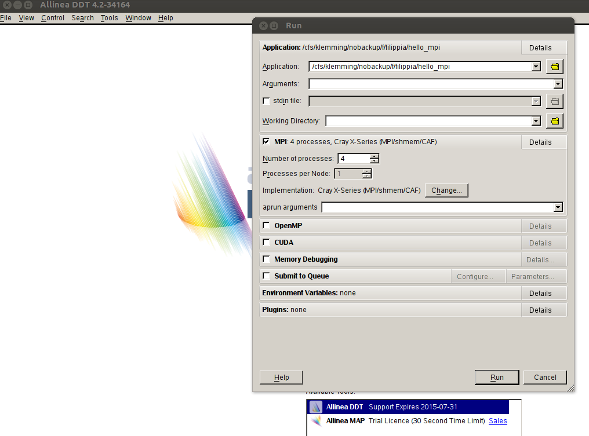
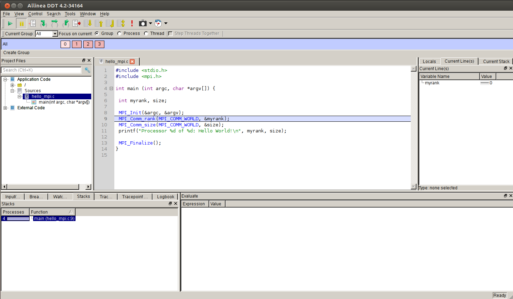
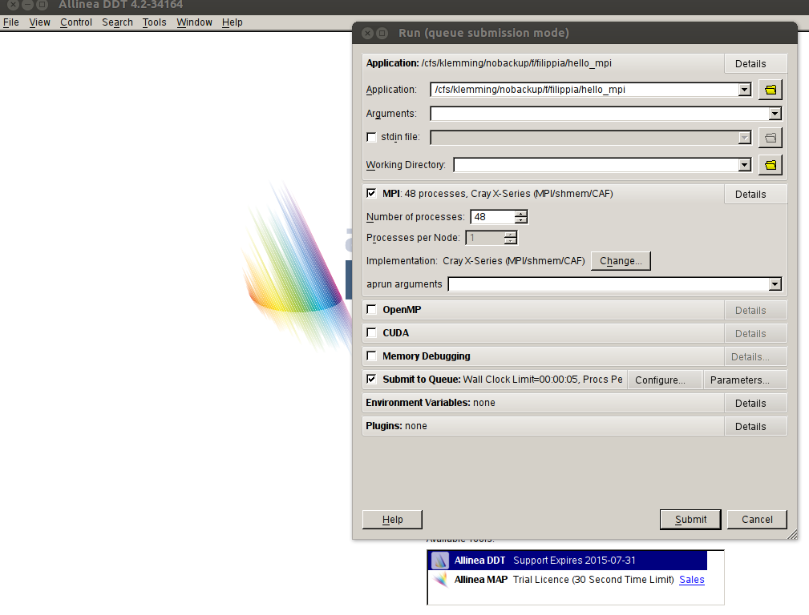
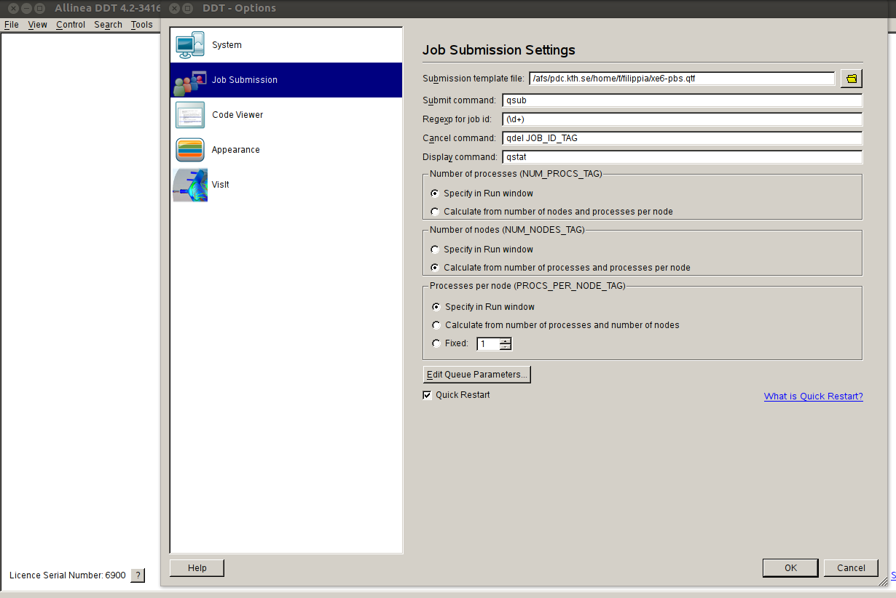
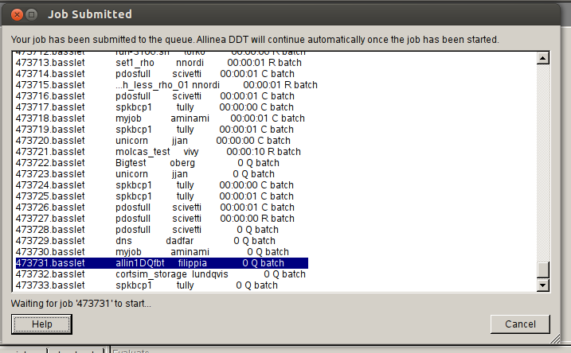
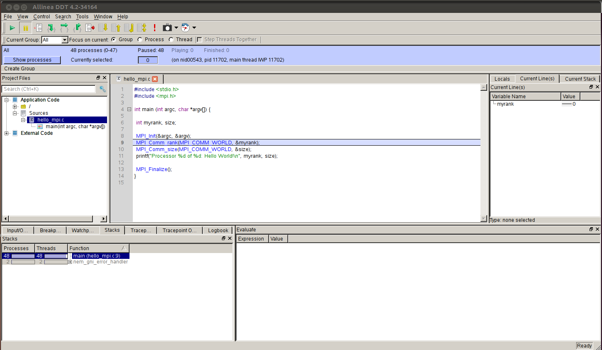

:orphan:

.. include:: using.inc

Make sure that you do not run DDT on the login node
but rather on an interactive node.

Interactive use on interactive nodes
------------------------------------

As an example, the following command is used to launch DDT in order to debug a
simple program with OpenMPI compiler. The executable is called ./hello_mpi, has
no arguments and uses 4 processes on one interactive node. If arguments were
needed they would be placed in the end of the command here or later in the
configuration::

  ddt -noqueue -n 4 ./hello_mpi

The Setting window is shown below. The settings are grouped into sections MPI,
OpenMP, CUDA, etc. Click the Details button to expand a section. For example,
here we can find the information in MPI section: 4 processes. OpenMPI. Here
OpenMPI is automatically detected. Submit to Queue is unchecked as the -noqueue
option was enabled in the execution.

If everything goes fine, the DDT Main Window like the one in the following
figure should display on the screen when you click button "Run". You can now
use various DDT debugging tools to debug your problems, see the `DDT User Guide
<http://www.allinea.com/products/ddt-support>`_.

Interactive use with nodes booked on the queue system
-----------------------------------------------------

In order to run DDT using the queue system you should use the login node in
order to be able to book nodes through DDT.. The following command is used to
launch DDT to debug a program called ./hello_mpi with no arguments (we could
place them in the end of the command if we had) using 2 nodes (16 processors)
in batch system::

  ddt -n 2 ./hello_mpi

Note that in the queue system, the number following the DDT option "-n" can be
number of nodes or processors. This is controlled by the paramete::

  # use num_nodes: yes/no

in the template file. In the example, "use num_nodes" is set to yes since in
Ferlin/Povel the option "-n" in command esubmit assigns number of nodes.

Just like in above section using interactive nodes, In the DDT Setting window,
the settings are grouped into sections MPI, OpenMP, CUDA, etc. Click Details to
expand a section. Here you can find the information in MPI section: 2 nodes (8
processes per node) OpenMPI. Click Submit to Queue if it is not already
checked.

Click on Configure to set up submission options.

Next, by clicking "Configure", A DDT Options window will open. In the pop-up
window choose Job Submission.  If a submission template file (e.g. pdc-easy.qtf
in the following) is correctly uploaded, the other boxes such as Submit
command, Regexp for job id etc. will be automatically filled. By clicking OK on
the pop-up you can close the window and go back to DDT Setting window.

In Section "Queue Submission Parameters", the default settings are "Wall Clock
Limit=15, Modules=i-compilers easy ddt". By clicking "Details...", a Window
with title "Queue Submission Parameters will display and you can edit the boxes
to change "Wall Clock Limit" and loaded modules.

By clicking "Submit", the job has been submitted and stayed in the queue
system.

If everything is OK, the DDT Main Window, like the following one, should be
displayed on the screen when the job is finished.

One sample template file pdc-easy.qtf used to submit job on Ferlin/Povel is written as

.. literalinclude:: files/pdc-easy.qtf
    :language: bash

Non interactive use (batch mode report)
---------------------------------------

It is also possible to run DDT in a non-interactive mode and to create an HTML
report. To do this, use the following command to create the HTML report::

  ddt -offline report.html -n 2 ./hello_mpi

Note that DDT will re-use the latest automatically saved session for the
example. If you have created some tracepoints and breakpoints which will appear
in the report file.

You can use a web browser, e.g. firefox, or other tools to open the report file::

  firefox report.html
