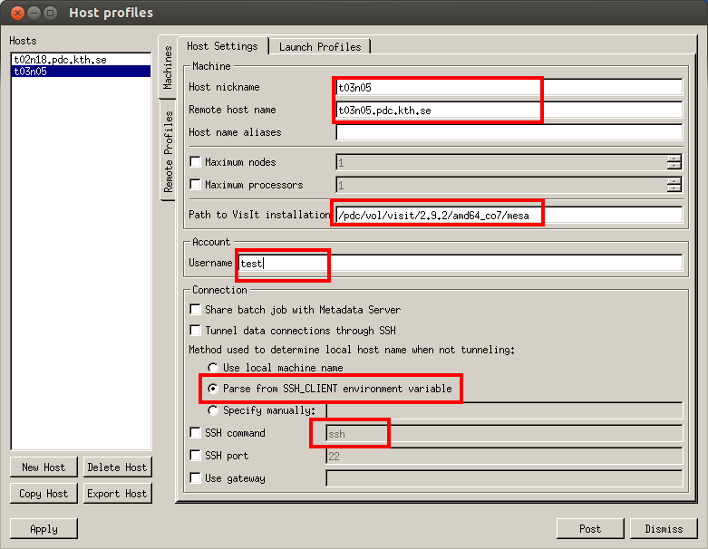

Running VisIt client on an interactive node on Tegner
-----------------------------------------------------

You can book a compute node for interactive running VisIt. The command to do this is salloc e.g. ::

 salloc --nodes=1 -t 1:00:00 

which will book one node for one hour. And then login on the node from local computer to run VisIt using commands ::

 module add visit/2.9.2 
 visit -np 24

Running VisIT client-server
----------------------------

Firstly you should have to add visit module in your PDC **.bashrc**  ::

 . /pdc/modules/etc/init/bash 
 module add  visit/2.9.2
 
And then book an interactive node from the login node (i.e. tegner).

.. code-block:: bash
    
   tegner$ salloc -N 1 -t01:00:00  # one hour
   salloc: Granted job allocation 2364
   salloc: Waiting for resource configuration
   salloc: Nodes t03n05 are ready for job

You can check if the setting is correct using command likes ::

 local$ ssh -Y username@t03n05.pdc.kth.se visit -np 8

which should open an VisIt GUI.

After that, you launch the corresponding VisIt client from your laptop or desktop computer. 

1. Open **Options** menu and chose **Host Profiles**

.. image:: files/visit-1-host-profile-dialog.png
    :width: 500pt

2. In the dialog box of *Host profiles* to create a **New Host**.
and in the **Host Setting** tab to set 

You need to change the following parameters :

**Host nickname**  : the host nickname 

**Remote host name** : your booked interactive node

**Path to VisIt installation** : /pdc/vol/visit/2.9.2/amd64_co7/mesa/bin
(versions > 2.8.2 needed) 

**Username** : your PDC username

**Parse from SSH_CLIENT environment variable** : Check box to enable

**SSH command** ssh (options)

 .. image:: files/launch_profiles.png 
    :width: 500pt

In the **Launch profiles** tab,

**Lauch paralle engine** : Check box to enable

**Number of processors** : set the number of processors

3. Connect to PDC cluster from the VisIt client on your computer.

Click the **Open** button in the VisIt main window and then in the **Host** field, 
chose the Host name(in the example, t03n05). Once successfully connected to PDC cluster you should 
be able to see the files in your PDC home folder. 

 .. image:: files/file_open.png
    :width: 500pt

Now you can change the path and open files for VisIt visualization.
 
