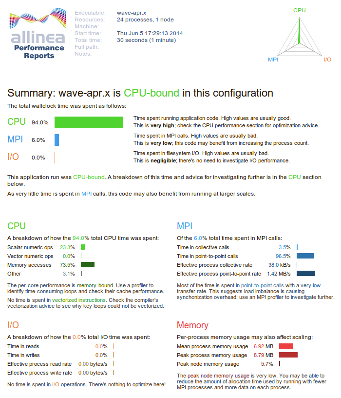

Compiling
=========
NOTE: In most cases Performance Reports can run on an unmodified binary with no recompilation or linking required.

Allinea provides a simple 1-D wave equation solver that’s useful as a profiling example program. Both C and Fortran variants are provided:
• examples/wave.c
• examples/wave.f90.
Both are built using the same makefile:
cd <INSTALL_DIR>/examples/
make -f wave.makefile

Note that although these example Makefiles include the -g flag, Performance Reports does not need this
and you should not use them in your own Makefiles. In most cases Performance Reports can run on an
unmodified binary with no recompilation or linking required.

On Cray X-series
----------------
On Cray X-series systems Performance Reports the example program must be explicitly linked with the Allinea profiling libraries.

First create the libraries using the command ``make-profiler-libraries --platform=cray --lib-type=static`` ::

	Created the libraries in /home/user/examples:
	libmap-sampler.a
	libmap-sampler-pmpi.a
	To instrument a program, add these compiler options:
	
	compilation for use with MAP - **not required** for Performance Reports:
	-g (or -G2 for native Cray fortran) (and -O3 etc.)
	
	linking (both MAP and Performance Reports):
	-Wl,@/home/user/examplesm/allinea-profiler.ld ...EXISTING_MPI_LIBRARIES
	
	If your link line specifies EXISTING_MPI_LIBRARIES (e.g. -lmpi) , then these must appear *after* the Allinea sampler and MPI wrapper libraries in
	the link line.

Then follow the instructions in the output to link the example program with the Allinea profiling libraries:
``cc -g -O3 wave.c -o wave -g -Wl,@allinea-profiler.ld -lm -lrt``
``ftn -G2 -O3 wave.f90 -o wave -G2 -Wl,@allinea-profiler.ld -lm -lrt``

Running
=======
As this example uses MPI you will need run on a compute node on your cluster. The simplest way when running small programs is often to request an interactive session, like this::
	
	$ salloc -t <time> -A <prj_name> -J <job_name> --nodes=<no_nodes>
	salloc: Granted job allocation 27145
	salloc: Waiting for resource configuration
	salloc: Nodes <node_name> are ready for job	
	$ ssh <node_name>
	<node_name>$ mpirun -n <no_procs> ./wave   

A coorect output is::

	Wave solution with 4 processes
	points = 1000000, running for 30 seconds
	
	               min	mean	max
	All time (ms): 30003	30003	30004
	CPU time (ms): 29101	29350	29891
	MPI time (ms): 113	653	903
	
	CPU time (%) : 97	98	100
	MPI time (%) : 0	2	3
	
	Iterations   : 30400	30400	30400
	points/second: 1013.2M (253.3M per process)
	wave finished

-------------------------------------

To profile a binary with Allinea Performance Reports
we need to compile it with the module allinea-reports/5.0-40810 loaded::

  $ module load allinea-reports/5.0-40810
  $ export CRAYPE_LINK_TYPE=dynamic

We compile an example code::

  $ cd $SNIC_TMP
  $ mkdir apr-test
  $ cd apr-test
  $ cp /pdc/vol/allinea-reports/5.0-40810/examples/wave.c .
  $ cc wave.c -o wave.x

The binary ``wave.x`` is now instrumented for Allinea Performance Reports.

We run this using the following run script:

.. literalinclude:: files/run-perf-report
    :language: bash

This run generates two files::

  wave_32p_2015-02-13_20-02.html
  wave_32p_2015-02-13_20-02.txt

You can open the html file in a browser or the txt file directly in the terminal.

The html file will look similar to this one:

